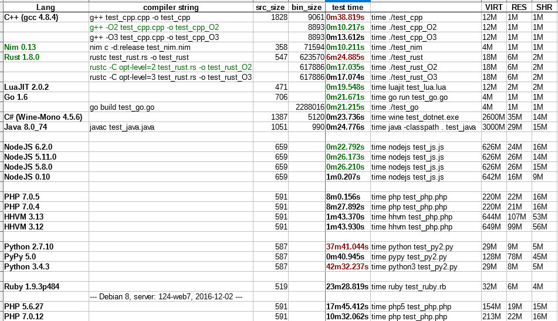

# About

Compare the Performance of several languages.  
Сравнение производительности Языков Программирования (для вычислительных задач).

Author: Razbitskiy Slava

First published date: 2016-03-17

Based on the article [Performance of several languages](http://blog.carlesmateo.com/2014/10/13/performance-of-several-languages)
(by Carles Mateo, 2014-2015).

## Цели и задачи

**Цель работы:** оценка эффективности ЯП для вычислительных задач

**Идея:** заключается в том, что данная оценка эффективности могла бы служить хорошим подспорьем, при выборе ЯП для "
Вычислителей".

**Решаемые задачи:**

* Сравнение времени исполнения программы (включая время запуска VM / интерпретатора);
* Сравнение потребляемой памяти при исполнении программы;
* Сравнение размера файла исходного (и, в ряде случаев, компилируемого) кода.
* Оценка "легкости" развертывания среды исполнения и "пригодности" для "консервативного подхода" в администрировании
  наших серверов.

## Методика
Я постарался воспроизвести оригинальное тестирование для интересующего меня набора ЯП
(10 240 000 000 итераций с помощью 3 вложенных циклов, с минимальным вызовом "библиотечных функций" и наличием условного ветвления),
но с небольшим изменением:

1. я сделал 2 счетчика:
   * оставил **i_counter** (int) без изменений - инкрементится с каждой итерацией; когда он достигает значения **50** - сбрасывается на 0;
   * добавил **l_counter** (int64) - только инкрементится с каждой итерацией (и в итоге становится равен кол-ву итераций).

   Тут проявился первый прикол - в некоторых языках пришлось принудительно указывать тип "Int64",
   не смотря на то, что ОС - 64-bit Linux.

2. В первый цикл верхнего уровня (от 0 до 9) - я добавил вывод на stdout номер итерации этого цикла.
3. Исходный код адаптировался под конкретный ЯП и выглядел примерно так:
```console
rasla@rasla:~/git/lang-test $ cat test_nim.nim
var i_counter = 0
var l_counter = 0

echo("Test Nim:")

## loops here
for loop1 in countup(0, 10-1):
  echo("loop1: ", loop1)
  for loop2 in countup(0, 32000-1):
    for loop3 in countup(0, 32000-1):
      i_counter += 1
      l_counter += 1

      if i_counter > 50:
        i_counter = 0
echo()
echo("i_Counter: ", i_counter)
echo("l_Counter: ", l_counter)
```

Итого, при запуске в консоли получаем:
```console
rasla@rasla:~/git/lang-test $ time ./test_nim
Test Nim:
loop1: 0
loop1: 1
loop1: 2
loop1: 3
loop1: 4
loop1: 5
loop1: 6
loop1: 7
loop1: 8
loop1: 9

i_Counter: 37
l_Counter: 10240000000

real    0m10.259s
user    0m10.204s
sys     0m0.016s
rasla@rasla:~/git/lang-test $
```

4. Я провел тестирование на более свежих версиях ПО и добавил ЯП, которых не было в оригинальном тесте (C#, Rust, Nim).

5. Для сравнения в таблицу добавлены колонки значений потребления памяти.

Тест каждого ЯП запускался 3 раза подряд, из которых выбиралось МИНИМАЛЬНОЕ ВРЕМЯ (time real), таким образом:
```console
rasla@rasla:~/git/lang-test $ time ./test_nim; time ./test_nim; time ./test_nim
```

## Reports

### 2021-12


### 2016-03-17


